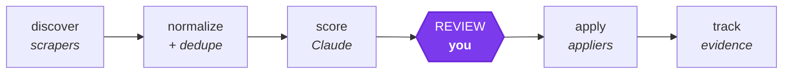
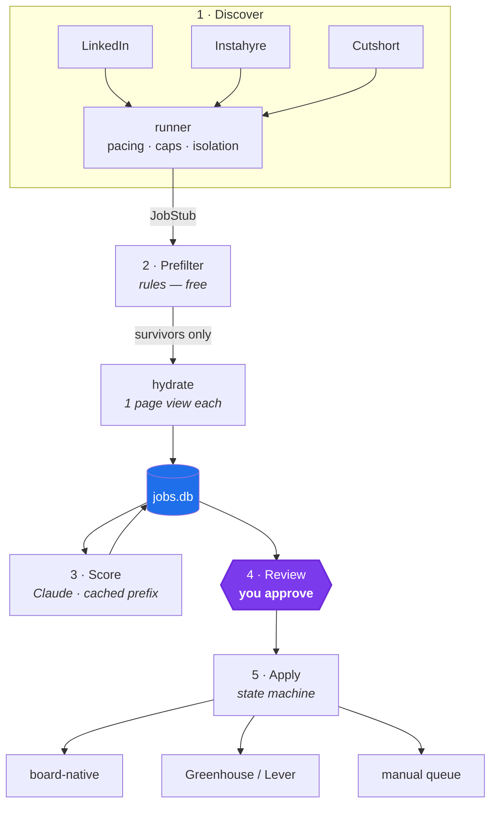
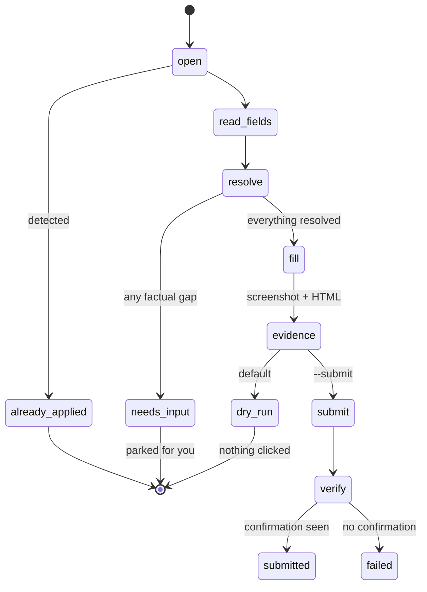
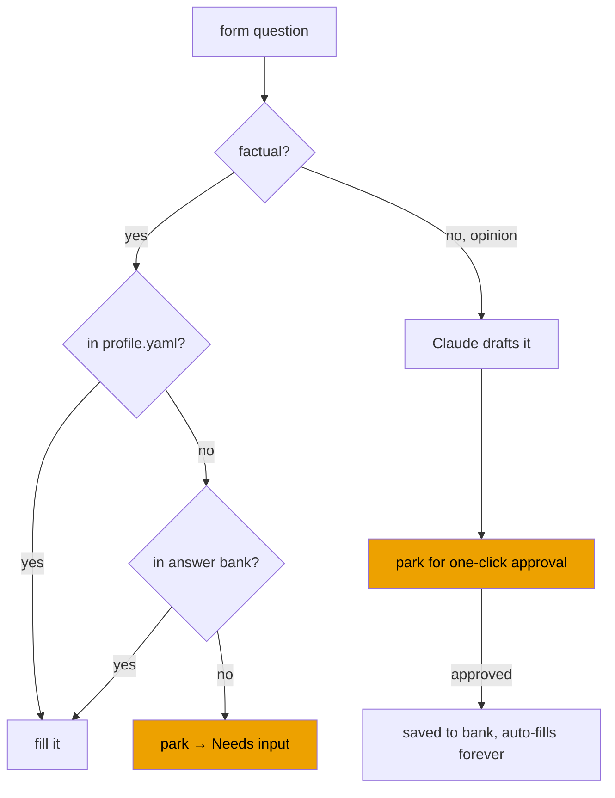

# jobbot

Scrape job boards, score every posting against your resume with Claude, review
a ranked list, and apply to the ones you tick — following through to
Greenhouse and Lever when a listing redirects to the company's own portal.



The review gate is the only place a human is required in the steady state.
Nothing is ever submitted without passing through it, and `jobbot apply` is a
**dry run unless you pass `--submit`**.

---

## Before you start

**LinkedIn's User Agreement prohibits automated scraping and automated
applying, and they detect and restrict accounts that do it.** Instahyre and
Cutshort have similar terms with weaker enforcement. This tool mitigates the
risk — a real logged-in browser session, randomized human-scale pacing, hard
daily caps, and a circuit breaker that stops a site the moment it shows any
sign of noticing — but it does not eliminate it.

**This repository ships with LinkedIn enabled**, because its author opted in
knowingly — the warning sits in `config/search.yaml` next to the flag itself.
That is a decision about one person's own account, not a recommendation. If
you clone this, make the call yourself before your first run:

```yaml
sites:
  linkedin:
    enabled: false
```

Account restriction is a real possible outcome.

---

## Setup

**Requirements:** Python 3.12+, [uv](https://docs.astral.sh/uv/), and a Claude
API key for the scoring stage.

```bash
git clone <your-repo-url> && cd Job_Apply_Automation

uv sync                              # install dependencies
uv run playwright install chromium   # the browser the scrapers drive

cp config/profile.example.yaml config/profile.yaml   # then fill it in
echo 'ANTHROPIC_API_KEY=sk-ant-...' > .env

uv run jobbot serve                  # → http://localhost:8000
```

Then do everything from the browser:

1. **Setup** — connect each job board, upload your resume, fill in your details.
2. **Run** — discover, score, then apply.
3. **Review** — approve the jobs worth applying to.

`uv run jobbot init` health-checks the whole setup and tells you what's missing.

### Connecting an account

Clicking **Connect** opens a real Chrome window. You log in there yourself —
username, password, 2FA, whatever the site asks — and the session cookie stays
in a browser profile under `data/browser/<site>/`.

**This tool never asks for, receives, or stores your job-board passwords.**
There is no password field anywhere in it, and there's a test asserting there
never will be. A scripted login is also the single most heavily fingerprinted
action on these sites, so doing it by hand is both safer for your credentials
and safer for your account.

> `data/browser/` holds live logged-in sessions. Treat that directory exactly
> like a password file — it is gitignored, and it should stay that way.

### Or use the CLI

The website runs these same commands and streams their output, so anything you
can do in the browser you can do in a terminal:

```bash
uv run jobbot init              # health-check the setup
uv run jobbot login instahyre   # once per site — you log in by hand
uv run jobbot discover          # scrape into data/jobs.db
uv run jobbot score             # rank against your resume
uv run jobbot apply             # dry run: fills forms, stops at submit
uv run jobbot apply --submit    # actually submits
```

`jobbot status` shows what's in the pipeline. `jobbot resume-site <site>`
clears a tripped circuit breaker. `jobbot inspect <site>` dumps a live page's
JSON endpoints for recalibrating a scraper.

---

# Design

Five stages, each independently runnable and resumable. **SQLite is the handoff
between them**, so a crash never loses work and any stage can be re-run without
redoing the ones before it.



### Why the pipeline is shaped this way

**Prefilter before the LLM.** Rule-based filters (location, title keywords,
excluded companies, max years) run first and cost nothing. They typically cut
the pool 40–60%, and every posting they drop is a Claude call never made.

**Scraping is split into `search` → `hydrate`.** List pages are cheap; detail
pages are the scarce, rate-limited resource. The runner dedupes and prefilters
*stubs* before hydrating, so a page view is never spent on a job already in the
database or one that would have been thrown away.

**Freshness is a first-class filter.** On a fast-moving board, being early is
most of the advantage. LinkedIn's date filter is really a seconds-ago value
(`f_TPR=r3600`), so 1-hour and 24-hour windows are both expressible, and the
dashboard has one-click chips for them.

**Cross-site dedupe by fingerprint.** `sha256(company + title + location)`,
normalized and stripped of seniority noise, collapses the same role seen on two
boards into one row — so you review it once and apply through whichever route
is cheapest.

## Data model

| Table | Key columns | Purpose |
|---|---|---|
| `jobs` | `source`, `source_job_id`, `url`, `title`, `company`, `location`, `posted_at`, `description`, `apply_route`, `ats_url`, `fingerprint`, `status` | One row per unique posting |
| `scores` | `job_id`, `model`, `fit_score`, `verdict`, `strengths`, `gaps`, `blockers`, `tailored_summary` | Claude's judgment; re-scoreable |
| `applications` | `job_id`, `status`, `method`, `attempts`, `submitted_at`, `evidence_path`, `error`, `answers_json` | Application lifecycle |
| `answers` | `question_norm`, `answer`, `kind`, `approved`, `times_used` | Reusable answer bank |
| `runs` | `kind`, `started_at`, `stats_json` | Audit trail + daily-cap accounting |

**Job status:** `new` → `scored` → `approved` → `applying` → `submitted`, with
`needs_input`, `manual`, `failed`, and `skipped` as branches.

**Apply route:** `board_native` · `ats_greenhouse` · `ats_lever` · `ats_other`
· `unknown`. Only the first three are automated; the rest go to the manual
queue with a direct link.

## Scoring architecture

The resume is constant and the job description varies — exactly the shape
prompt caching wants.

```
system:   [ rubric, resume ]     ← cache breakpoint on the LAST block
messages: [ job description ]    ← the only part that varies
```

Nothing job-specific may appear anywhere in the system prompt. A single
interpolated job ID or timestamp there would invalidate the prefix on every
call and silently cost full price. Responses come back through
`client.messages.parse()` against a Pydantic `FitScore` model, so they're
validated rather than regex-scraped.

Above 30 pending jobs, scoring switches to the **Message Batches API**
automatically for half price. Batch results return in arbitrary order and are
keyed by `custom_id` — zipping them against the input list would attach the
wrong score to the wrong job, so it doesn't.

## The apply state machine



**`open_form()` must never perform an action that could submit.** It runs
*before* the dry-run gate. This is not a style preference — it was learned the
hard way: an early Instahyre applier clicked "Apply" in `open_form()` to "reach
the form", but Instahyre has no form, so that click *was* the application. A
dry run sent two real applications. Anything irreversible now lives in
`submit_form()`, boards that apply in one click are marked
`allows_empty_form`, and `tests/test_dry_run_safety.py` fails if that ever
regresses.

## Answer resolution



**The bot never invents a factual answer about you.** Facts come from
`profile.yaml` or they don't get answered. If a form asks something the profile
doesn't cover, the application parks rather than guessing — a wrong salary or
visa answer on a real application isn't recoverable, and a delayed one is. A
question that can't be classified is treated as factual, because that's the
safe default.

Opinion questions may be *drafted* by Claude, but a draft is never submitted.
Fill is also all-or-nothing: one unanswerable question leaves the entire form
untouched, so you never end up with a half-filled application.

## Safety rails

| Rail | Behaviour |
|---|---|
| Pacing | 3–9s randomized delays; no parallelism within a site |
| Daily caps | Per-site, enforced against the `runs` table |
| Per-company cap | Default 3/week, so you don't spam one employer |
| Circuit breaker | Halts a site 24h on captcha / "unusual activity" / 429 |
| Dry run | The default everywhere; `--submit` is the explicit opt-in |
| Evidence | Screenshot + HTML saved for every attempt, dry or real |
| No unconfirmed success | A submit click without a confirmation reports *failed* |

## Layout

```
config/          search.yaml (committed) · profile.yaml (yours, gitignored)
data/            jobs.db · resume · browser sessions · evidence — all gitignored
src/jobbot/
├─ cli.py        typer: init/login/discover/score/serve/apply/status/inspect
├─ config.py     pydantic models over config/*.yaml
├─ db.py         SQLAlchemy models, fingerprinting, session scope
├─ resume.py     PDF/DOCX → text, cached by content hash
├─ browser/      persistent contexts, pacing, circuit breaker
├─ scrapers/     base contract · linkedin · instahyre · cutshort · sniffer
├─ scoring/      cached-prefix matcher, FitScore schema, batch path
├─ appliers/     state machine · answer bank · board + ATS appliers
└─ web/          FastAPI + Jinja dashboard, SSE live output
tests/           447 tests, no network
```

---

## The website

| Page | What it's for |
|---|---|
| **Home** | Pipeline donut — what's pending, queued, submitted |
| **Setup** | Connect job boards, upload your resume, fill in your details |
| **Run** | Trigger discover / score / apply, with live streamed output |
| **Review** | Ranked jobs with Claude's reasoning — approve or skip |
| **Needs input** | Applications parked on a question only you can answer |
| **Manual** | Portals that aren't automated, with a link and a done button |

It binds to `127.0.0.1` and has no authentication, which is fine for a local
tool and **not** fine on a shared or public machine — it shows your resume
analysis and can send applications. Don't expose the port.

Real submissions take two deliberate acts in the UI: tick *Actually submit*,
then tick the confirmation that appears. The button relabels itself so it's
never ambiguous which mode you're in.

---

## Configuration

| File | What it holds | Committed? |
|---|---|---|
| `config/search.yaml` | Search queries, filters, daily caps, model choice | yes |
| `config/profile.yaml` | Your facts — name, phone, CTC, visa, notice period | **no** |
| `config/answers.yaml` | Approved answer bank, grows over time | **no** |
| `data/resume.*` | Your resume | **no** |
| `data/browser/` | Logged-in sessions — treat like credentials | **no** |

A search query supports keyword, location, remote-only, and a freshness window
in either hours or days:

```yaml
sites:
  linkedin:
    enabled: true           # see the warning at the top before you run this
    daily_cap: 40
    queries:
      - label: "Fresh — last hour"
        keywords: "backend engineer"
        location: "India"
        posted_within_hours: 1
```

---

## Cost

Scoring uses `claude-opus-5` with the resume as a cached prompt prefix, so
every job after the first reads it at ~10% of input price. Above 30 pending
jobs it switches to the Batches API at half price automatically.

Roughly **$0.03–0.05 per job** at default settings; about half that on the
batch path. `jobbot score` prints token spend and cache hit ratio after every
run — a 0% hit ratio means something is invalidating the prefix and you are
silently paying full price.

To trade accuracy for cost, edit `config/search.yaml`:

```yaml
model:
  scoring: claude-sonnet-5   # or claude-haiku-4-5
  effort: medium             # low | medium | high | xhigh | max
```

---

## Which portals get automated

| Route | Behaviour |
|---|---|
| Board-native (Instahyre, Cutshort, LinkedIn Easy Apply) | Automated |
| Greenhouse, Lever | Automated — stable, well-structured forms |
| Workday, Taleo, iCIMS, unknown | **Manual queue** with a direct link |

Fighting Workday's multi-page wizard produces half-submitted applications,
which is worse than two minutes of your own time. Those land in the *Manual*
tab with a "mark as applied" button so tracking stays accurate.

---

## Development

```bash
uv run pytest                    # 447 tests, no network
uv run ruff check src/ tests/
```

No test touches the network. The Anthropic client is stubbed; browser tests
drive a local Chromium against fixture HTML in `tests/fixtures/`.

### Invariants the suite pins

Each of these fails *silently* rather than loudly, which is why each has a test
written specifically to make it fail loudly. Most were added after the failure
happened.

- **Dry run never submits** — anything irreversible lives in `submit_form()`,
  never in `open_form()`, which runs before the gate.
- **Never fabricate** — a factual question with no profile entry must park, and
  must never reach the drafter, even when one is supplied.
- **All-or-nothing fill** — one unanswerable question leaves the whole form
  untouched, verified against a real DOM.
- **No unconfirmed success** — a submit click without a confirmation is
  reported as failed.
- **Prompt-cache placement** — breakpoint on the last system block, and no
  job-specific bytes anywhere in the cached prefix.
- **Batch `custom_id` keying** — results return in arbitrary order; zipping
  them against the input list would misattribute every score.
- **`login_complete()` never navigates** — it's polled every couple of seconds
  while you're typing credentials. A `page.goto()` in that path reloaded the
  login form out from under the user every few seconds.
- **Scraper extraction targets the right list** — LinkedIn's payload contains a
  filter panel and a schema block that both out-rank the real job list under a
  "longest list with a `title` key" heuristic. Match cards exactly, not by
  shape.
- **Freshness counts match what they show** — a chip reading "last hour 29"
  must open a page with 29 rows.
- **Cross-site dedupe** — the same role on two boards collapses to one row.

### Calibrating a scraper

Job boards change their markup constantly:

```bash
uv run jobbot inspect instahyre
```

This opens a real browser, records every JSON endpoint the page hits and the
shape of each response, and saves the rendered DOM to `data/inspect/`. The
scrapers read the boards' internal JSON APIs where possible and fall back to
DOM selectors, so calibration is usually a matter of confirming which endpoint
carries the job records.

---

## Status

| Phase | State |
|---|---|
| 1. Foundation — config, DB, resume parsing, CLI | done |
| 2. Browser sessions, pacing, safety rails | done |
| 3. Scoring — cached prefix, structured output, batch | done |
| 4. Review dashboard | done |
| 5. Scrapers — Instahyre, LinkedIn | done, calibrated live |
| 6. Appliers — state machine, answer bank, board portals | done |
| 7. ATS — Greenhouse, Lever, detection, link resolution | done |
| 8. Web control panel — setup, run, live output | done |
| 9. Cutshort scraper | written, not yet calibrated live |
| 10. Scheduling, notifications | pending |

The pipeline is verified end to end against fixture forms with a real browser:
it fills every field including file upload, selects, radios and checkboxes;
parks without typing anything when a required question is unanswerable; and
reports failure rather than success when a submission can't be confirmed.

Instahyre and LinkedIn are calibrated against live logged-in accounts —
including LinkedIn's Voyager JSON payloads and its 1h/24h freshness windows.
Cutshort is written against observable structure but hasn't had its live pass
yet, so expect one round of `jobbot inspect` there.
